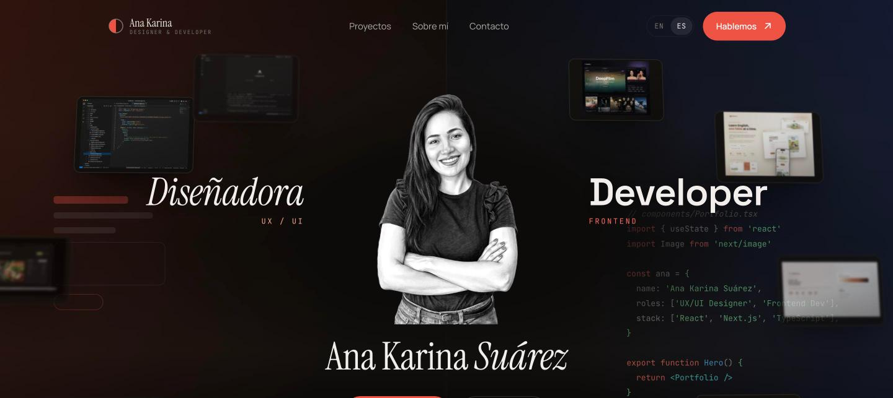

# Ana Karina Suárez González — Portfolio

> Personal portfolio of a **Frontend Developer & UX/UI Designer** based in Seville — designing and building accessible, fast digital products with React, Next.js and AI-accelerated workflows.

<p align="center">
  
</p>

<p>
  
  
  
  
  
</p>

**Live:** _deploying to Vercel_ · **Languages:** 🇪🇸 Español / 🇬🇧 English

---

## Overview

A bilingual, single-page portfolio built to convert visits into interviews. Priorities: **clarity, speed, SEO and accessibility.** Every section is designed first (Figma) and then implemented with exact fidelity — same spacing, type and colour, not approximations.

It's a showcase of two disciplines in one profile: **UX/UI design** and **frontend engineering**, with an editorial, motion-led interface.

## Highlights

- **Bilingual (ES/EN)** with a client-side language switch — no full reload.
- **Editorial, motion-led UI** — dual designer/developer hero, an interactive project carousel, and a 3D "skills" cube inside an orbit of technologies.
- **Custom design system** — semantic CSS + design tokens (colour, type, spacing, easing) with two visual directions and accent theming. See [`design-system.md`](./design-system.md).
- **AI chat assistant** — a lazy-loaded widget that answers questions about the profile and helps book a call.
- **SEO-first** — Next.js Metadata API, Open Graph + Twitter cards, JSON-LD (`Person` + `WebSite`), dynamic OG image, `sitemap.xml` and `robots.txt`.
- **Accessible** — semantic HTML, full keyboard navigation, visible focus, `prefers-reduced-motion` support (WCAG AA).
- **Fast** — `content-visibility` on below-the-fold sections, code-split/lazy widgets, `next/font` + `next/image` optimisation.

## Performance (Lighthouse, mobile)

| Performance | Accessibility | Best Practices | SEO |
|:-----------:|:-------------:|:--------------:|:---:|
| 90 | 95 | 100 | 100 |

## Tech stack

- **Framework:** Next.js 16 (App Router) · React 19 · TypeScript (strict)
- **Styling:** Semantic CSS + design tokens (CSS variables). Tailwind CSS v4 is used only as a base/reset — component styles are hand-authored for pixel fidelity.
- **Fonts / images:** `next/font` (self-hosted) · `next/image`
- **i18n:** lightweight React context (ES/EN)
- **Deploy:** Vercel

## Getting started

```bash
# install
npm install

# run the dev server → http://localhost:3000
npm run dev

# production build + start
npm run build
npm run start

# lint
npm run lint
```

### Environment

The AI assistant (`/api/chat`) needs a Groq API key — free tier, no card required:

```bash
cp .env.example .env.local   # then paste your key from https://console.groq.com/keys
```

Without it the chat degrades gracefully: it answers with Ana's email instead of
failing. On Vercel, add `GROQ_API_KEY` under Project Settings → Environment Variables.

`CAL_BOOKING_URL` is optional: set it to a public Cal.com event link and the
assistant hands visitors a pre-filled booking page so they pick a slot against
Ana's real availability. Left empty, the meeting card falls back to email.

## Project structure

```
app/                 App Router entry, layout, metadata, OG image, sitemap, robots
app/styles/          Design system — tokens.css (source of truth), sections.css, fx.css, chat.css
components/
  sections/          Hero · Work · About (+ SkillsOrbit) · Contact
  layout/            Nav · Footer
  chat/              AI assistant (lazy-loaded)
  ui/                Reusable primitives (ImageSlot, Logo, Arrow…)
  i18n/              Language provider (ES/EN)
  seo/               JSON-LD structured data
lib/                 Site config, images map, motion hooks
public/              Images, icons, CVs, docs
design-system.md     Design tokens reference
```

## Design system

The visual language lives in [`app/styles/tokens.css`](./app/styles/tokens.css) and is documented in [`design-system.md`](./design-system.md): typography, surfaces, text, accent, spacing, radius and easing — all as CSS variables, with light/dark visual directions and accent theming.

## Author

**Ana Karina Suárez González** — Frontend Developer & UX/UI Designer · Seville, Spain

- LinkedIn: [Ana Karina Suárez González](https://www.linkedin.com/in/connect-ana-karina-su%C3%A1rez-gonz%C3%A1lez/)
- GitHub: [@anakarinasuarez](https://github.com/anakarinasuarez)
- Email: karinasuarezdos@gmail.com

---

<sub>Designed & built by Ana Karina — with a little help from AI agents.</sub>
